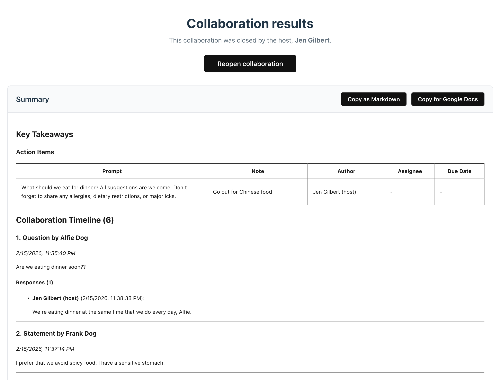

# Chord

Chord is a collaboration app written almost entirely by AI. I'm usually very strict about what I allow AI to contribute to my codebases, but this project had only one mantra: **Let go and let Claude.**

## How it works

### 1. Someone creates a collaboration


Once the collaboration is started, others can join by visiting its unique URL (but the host has to let them in).

### 2. Everybody collaborates by adding notes (it's pure chaos)

The host's view:


The participant's view:


### 3. The host ends the collaboration, and everyone can view a summary

The summary can be copied as Markdown or as Google Doc-compatible HTML.



## Setup

### Install the Firebase Emulator

1. Install the Firebase tools:

```shell
npm i -g firebase-tools@latest
```

2. Install Java, if not already installed:

```shell
brew install openjdk@21
```

### Set up the project

1. Clone the repo:

```shell
git clone git@github.com:jhgilbert/chord.git
```

2. Install the packages:

```shell
npm install
```

3. Log into Firebase:

```shell
firebase login
```

4. Initialize the emulator:

```shell
firebase login
firebase init emulators
```

Follow the prompts to ...

- Enable the Firestore emulator
- Enable Emulator UI (an option that will appear in a later menu)
- Select or create a Firebase project (this will only impact your local env, so your decision is not that important)

5. In the `.env.development` file, set the `VITE_FIREBASE_PROJECT_ID` variable to your project ID.

### Start the project

1. Start Firebase in one terminal tab:

```shell
npm run start-firebase
```

2. Start Vite in another terminal tab:

```shell
npm run dev
```

You should now see the app at `localhost:5173`, and the handy Firebase Emulator UI at `localhost:4000`.
