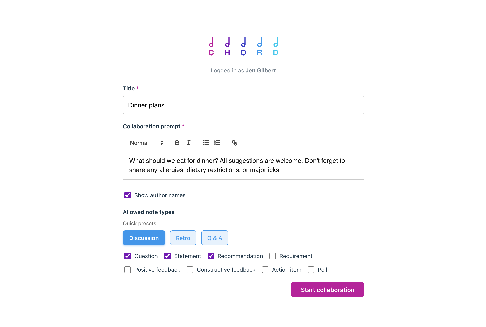
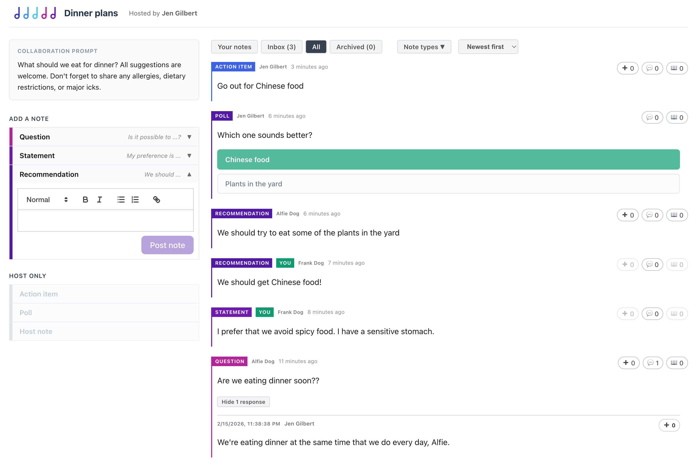
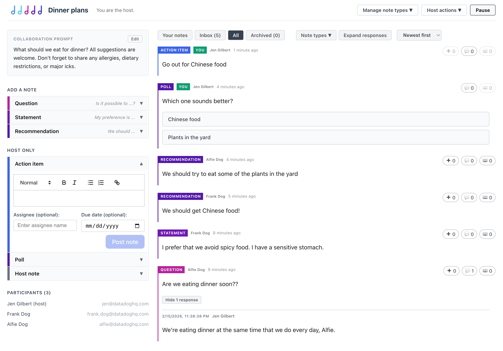
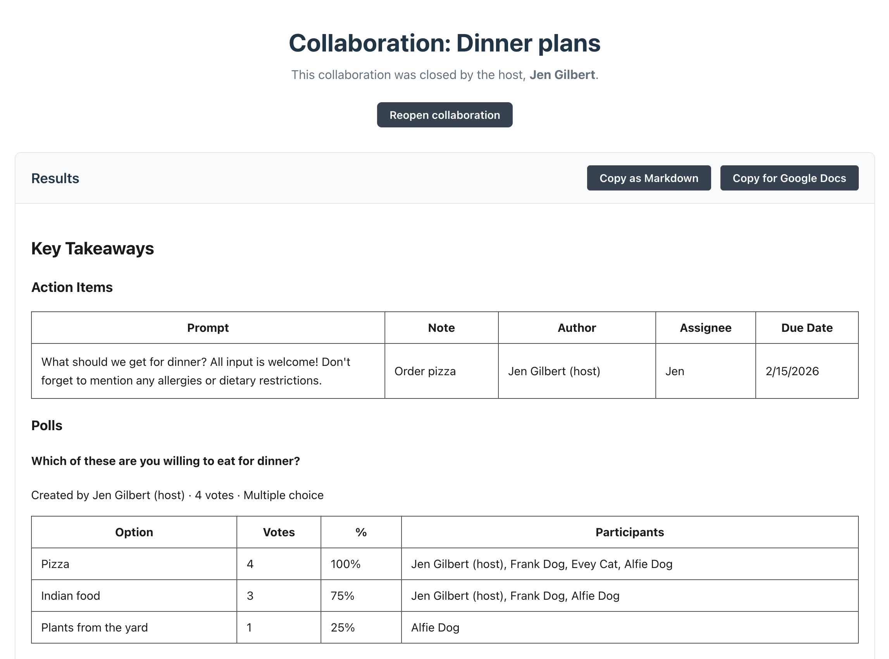
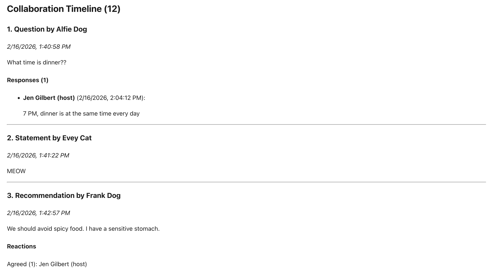

# Chord

Chord is a collaboration app written almost entirely by AI. I'm usually very strict about what I allow AI to contribute to my codebases, but this project had only one mantra: **Let go and let Claude.**

Chord performs three main tasks:

- Collect notes from everyone.
- Allow participants to react to each other's notes.
- Create a text artifact from that collaboration that can be copy-pasted into a Google Doc or Markdown file.

## How it works: A story about dinner

### 1. The host creates a collaboration

Jen wants to know what everyone wants for dinner, so she creates a collaboration called "Dinner plans."

The collaboration's prompt shares more details about the kind of input she's looking for.



### 2. Participants join the collaboration

Jen is automatically the host.

1. Jen shares the collaboration URL with Frank and Alfie.
2. Frank and Alfie each visit the URL, and wait in the lobby.
3. Jen accepts their request to join the collaboration.

### 3. Participants add notes, and react to each other's notes

The chaos begins! Everyone brainstorms together with the goal of pooling their knowledge, preferences, concerns, and so on.

Here is the participant's view of the dinner collaboration:



Each participant can view their inbox, a chronological list of everyone else's notes. Reacting to a note removes it from the inbox.

Participants can

- Upvote the note
- Comment on the note
- Mark the note as read

Any of these actions will dismiss the note from their inbox.

### 4. The host guides the conversation

The host can act as a participant, but also has additional facilitation privileges.

At any point in the collaboration, the host can:

- Pause the collaboration to discuss items
- Evolve participant input by enabling or disabling different note types
- Add a poll to narrow the topic or guide decisionmaking
- Add an action item, with optional assignee/due date

The host's view reflects these additional options:



### 5. The host ends the collaboration, and everyone with access can view a report

When the conversation has reached its desired conclusion, the host ends the collaboration. (If this is done in error or the conversation spans multiple sessions, the collaboration can always be resumed where it left off.)

When a collaboration has ended, its URL displays a report that can be copied as Markdown or as Google Doc-compatible HTML.

The report includes key takeaways, like action items and poll results:



At the bottom of the report is the full timeline of the collaboration.



## Setup

### Install the Firebase Emulator

1. Install the Firebase tools:

```shell
npm i -g firebase-tools@latest
```

2. Install Java, if not already installed:

```shell
brew install openjdk@21
```

### Set up the project

1. Clone the repo:

```shell
git clone git@github.com:jhgilbert/chord.git
```

2. Install the packages:

```shell
npm install
```

3. Log into Firebase:

```shell
firebase login
```

4. Initialize the emulator:

```shell
firebase login
firebase init emulators
```

Follow the prompts to ...

- Enable the Firestore emulator
- Enable Emulator UI (an option that will appear in a later menu)
- Select or create a Firebase project (this will only impact your local env, so your decision is not that important)

5. In the `.env.development` file, set the `VITE_FIREBASE_PROJECT_ID` variable to your project ID.

### Start the project

1. Start Firebase in one terminal tab:

```shell
npm run start-firebase
```

2. Start Vite in another terminal tab:

```shell
npm run dev
```

You should now see the app at `localhost:5173`, and the handy Firebase Emulator UI at `localhost:4000`.
