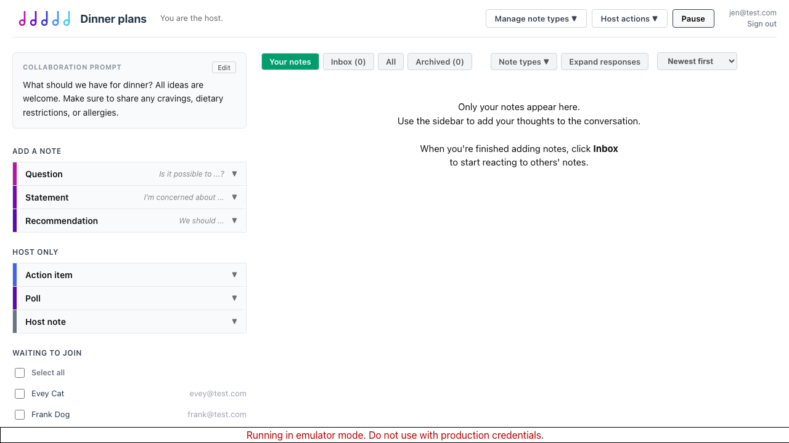
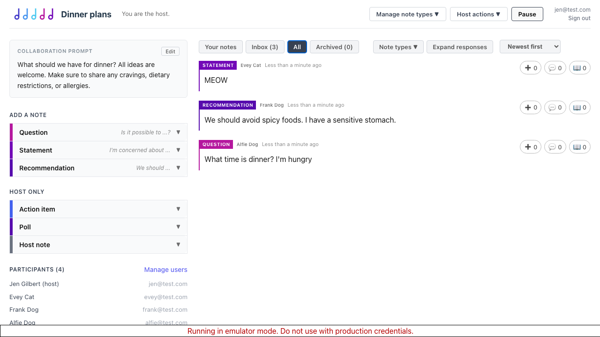
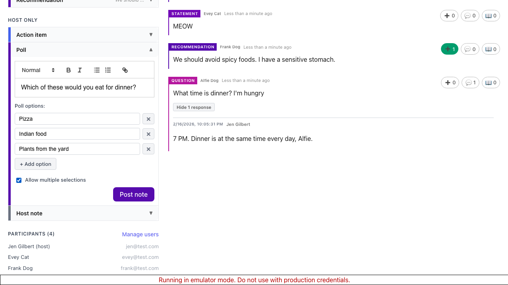
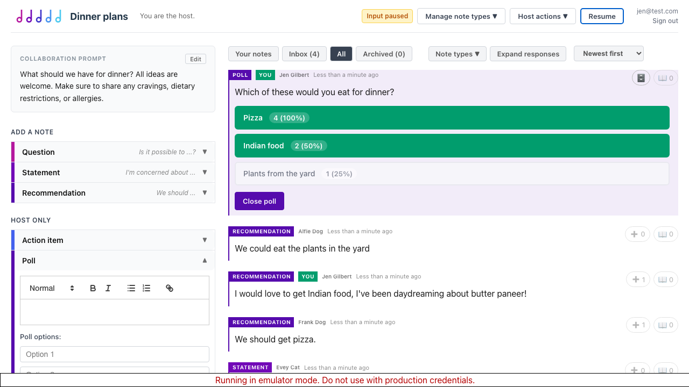
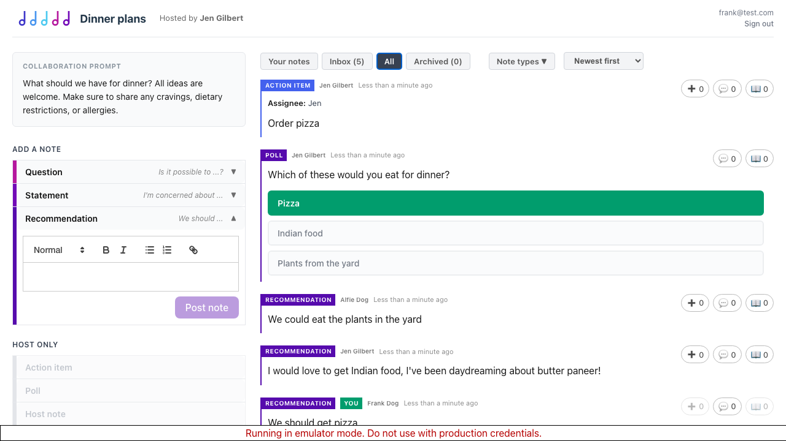

# Chord: Feature Tour

This walkthrough uses screenshots generated by the [end-to-end test](collaboration.spec.ts), so the images always reflect the current state of the app.

## Setting up a collaboration

The host creates a collaboration by entering a title and prompt. Note type presets control which kinds of notes participants can submit. The **Discussion** preset includes Questions, Statements, and Recommendations. Other presets like **Retro** offer different note types.

The host switches back to Discussion and fills in the prompt: *"What should we have for dinner? All ideas are welcome."*

## Starting the collaboration

After clicking **Start collaboration**, the host sees the live collaboration view. A share link is available for participants to join.

## Participants joining

Three participants (Frank, Alfie, and Evey) open the share link. They land in a waiting room until the host approves them.

The host uses **Select all** and **Admit selected** to let everyone in at once.

## Submitting notes

Participants submit notes using the available note types:

- **Alfie** asks a Question: *"What time is dinner? I'm hungry"*
- **Frank** posts a Recommendation: *"We should avoid spicy foods. I have a sensitive stomach."*
- **Evey** makes a Statement: *"MEOW"*

Each participant can view everyone's notes by switching to the **All** tab.

The host sees the same notes in their All view.

## Responding to notes

The host can respond to any note with a threaded comment. Here, the host replies to Alfie's question: *"7 PM. Dinner is at the same time every day, Alfie."* The host also upvotes Frank's recommendation about spicy foods.

## Creating a poll

The host (or any participant) can create a poll. This one is a multi-select poll asking *"Which of these would you eat for dinner?"* with three options: Pizza, Indian food, and Plants from the yard.

## Voting and results

After the poll is submitted, participants vote from their **Inbox**. The host pauses the collaboration to review results. Poll results show vote counts and percentages:

- Pizza: 4 votes (100%)
- Indian food: 2 votes (50%)
- Plants from the yard: 1 vote (25%)

Participants also see the results while the collaboration is paused.

## Upvotes and sorting

Notes can be upvoted by any participant. The host can sort by **Most upvotes** to surface the most popular ideas.

## Action items

The host resumes the collaboration and creates an action item: *"Order pizza"*, assigned to Jen. Action items are a distinct note type with optional assignee and due date fields.

Participants see the same notes and action items in their view.

## User management

The host can view a users page showing each participant's activity: notes posted, reactions, responses, and last activity. From here, the host can revoke a participant's access.

## Ending the collaboration

When the host ends the collaboration, a results report is generated. The report includes:

- **Action Items** with prompt, note text, author, assignee, and due date
- **Poll results** with vote counts and percentages

Participants with access see the same report.

Revoked participants cannot view the report.
